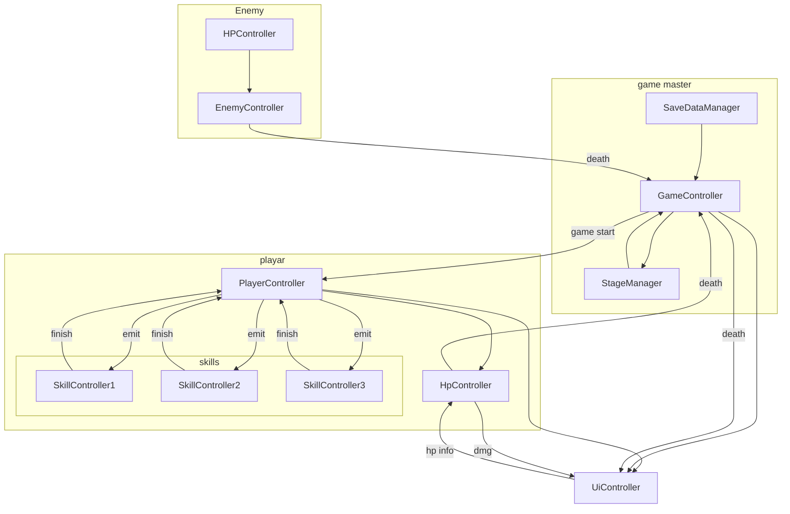

# コンセプト

- シールド×弾幕で戦うローグライクトップダウンシューティング
- テーマはハッキング

# どんな感じか

- 常に発射し続ける低ダメージの弾
- 進行していくとスキルスロットやスキル、回復アイテムをゲットすることができる
- トップダウンシューティング
- 常にシールドを展開している
- シールドは回復速度が早く、通常弾では削り切れない
- スキルでのみ削り切れて相手に攻撃できる
- せめてせめてせめまくれ！！！

# もっと具体的に

- スマホゲー（PCも可）
- Unityを使用
- カメラ固定
- グラフィックは超シンプル
- マテリアルファイルを全体で統一して、状況によってすぐ色を変えられるように
- プレイヤーやプレイヤーの攻撃エフェクトはすべて白で統一
- 敵は黒で統一
- 背景色は進行度によって変える
- 敵のビジュアルは丸とか三角とかの超シンプル構成
- ボスは↑プラス王冠とか翼とかが付く
- シールドがダメージを受けるたびに画面にグリッチが走る
- １分毎にショップフェーズが開始され、スキルやスキルスロット、回復アイテムを購入できる
- ショップフェーズは毎回ランダムで３つのアイテムが販売される
- 敵を倒すとストレージと呼ばれる通貨を落とす
- ショップフェーズではストレージを支払うことでアイテムを購入できる
- 自分のシールドはメモリという単位を用いる
- シールドがはがれて本体に攻撃されたら死
- 死んだらスキップ可能な3秒程度の演出をいれて即座にリスポーン選択可能画面に遷移

# 基本設計

