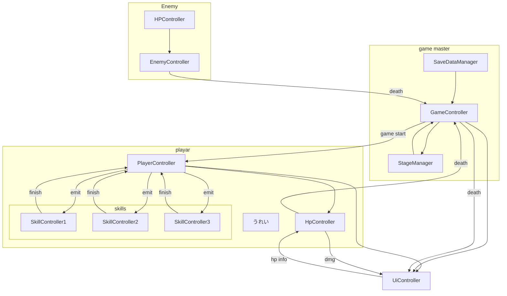

# コンセプト

- シールド×弾幕で戦うローグライクトップダウンシューティング
- テーマはハッキング

# どんな感じか

- 常に発射し続ける低ダメージの弾
- 進行していくとスキルスロットやスキル、回復アイテムをゲットすることができる
- トップダウンシューティング
- 常にシールドを展開している
- シールドは回復速度が早く、通常弾では削り切れない
- スキルでのみ削り切れて相手に攻撃できる
- せめてせめてせめまくれ！！！

# もっと具体的に

- スマホゲー（PCも可）
- Unityを使用
- カメラ固定
- グラフィックは超シンプル
- マテリアルファイルを全体で統一して、状況によってすぐ色を変えられるように
- プレイヤーやプレイヤーの攻撃エフェクトはすべて白で統一
- 敵は黒で統一
- 背景色は進行度によって変える
- 敵のビジュアルは丸とか三角とかの超シンプル構成
- ボスは↑プラス王冠とか翼とかが付く
- シールドがダメージを受けるたびに画面にグリッチが走る
- ショップフェーズは「ボス撃破または1分経過のどちらか早い方」で開始する。ショップ開始時にゲーム内タイマーはリセットされ、次のショップまで再びカウントされる。
- ショップフェーズは毎回ランダムで3つのアイテムが販売される
- 敵を倒すとストレージと呼ばれる通貨を落とす
- ショップフェーズではストレージを支払うことでアイテムを購入できる
- 自分のシールドはメモリという単位を用いる
- シールドがはがれて本体に攻撃されたら死
- 死亡時の扱い：プレイヤーのコアに致命的なダメージが入る（コア被弾）とゲームオーバー扱いとなる。スキップ可能な3秒程度の演出の後、コンティニュー（リスポーン）選択画面へ遷移する。コンティニューを選ぶと、所定のストレージを消費して即座にリスポーンする。ストレージが不足している場合はリザルトへ遷移する

# ゲームの流れ

## タイトル画面

- タイトルとスタートボタンと設定ボタンを表示
- スタートボタンを押すとゲーム開始

## プレイヤースポーン

- プレイヤーは画面中央に配置され、常に弱弾を発射し続ける
- 画面端には壁がある

## 敵のスポーン

- 敵はプレイヤーから離れているランダムな場所にスポーンする
- 各敵に、評価値があり、ステージ全体の評価値の合計が一定まで下がると、敵が補充される
- 敵はスポーンするとき、事前に画像認識のようなUIが表示される
- UIは画像認識のようなUIで、スポーンする敵の種類が表示される
- 敵はスポーンしてから数秒後に攻撃を開始する
- 敵は攻撃を開始する前に、攻撃の予備動作を行う
- 敵の攻撃は、プレイヤーのシールドを削ることができるが、プレイヤーのHPを削ることはできない
- 敵の攻撃は、プレイヤーのシールドがはがれた後に、プレイヤーに直接のダメージを与えることができる
- 敵自身もシールドを持っていて、プレイヤーの攻撃でシールドがはがれると、敵のコアに攻撃できる
- 敵のコアはHPを持っていて、HPが0になると敵は死ぬ
- 敵はフェーズによって、各種類の敵がスポーンする頻度や攻撃値の強さが変わる
- 雑魚敵と中ボスがスポーンするフェーズを、ノーマルフェーズとする
- ボスがスポーンするフェーズを、ボスフェーズとする
- ノーマルフェーズが3回続いた後に、ボスフェーズが来る

### 敵の種類

- 雑魚
  - HPが低い
  - 攻撃力が低い
  - 攻撃の予備動作が短い
  - スポーンする頻度が高い
  - 時間は多少かかるが、弱攻撃だけで倒せる
- 中ボス
  - HPが中程度
  - 攻撃力が中程度
  - 攻撃の予備動作が中程度
  - スポーンする頻度が中程度
  - 弱攻撃だけでは倒せず、スキルを使ってシールドを割る必要がある
- ボス
  - HPが高い
  - 攻撃力が高い
  - 攻撃の予備動作が長い
  - ボスフェーズでのみスポーンする
  - 弱攻撃だけでは倒せず、スキルを使ってシールドを割る必要がある
  - コアが露出しても一定ダメージを受けたまたは、一定時間経過した後に、再びシールドが展開される
  - 何度もシールドを割り、ダメージを与える必要がある。
  - 倒すと、次のフェーズに進む

## ショップフェーズ

- ショップフェーズは「ボス撃破または1分経過のどちらか早い方」で開始する（どちらか早い方）。ショップ終了後、ゲーム内のショップタイマーはリセットされる。
- 開始すると、画面にショップのUIが表示される
- ショップのUIには、購入可能なアイテムが3つ表示される
- プレイヤーは3つのアイテムから1つを選択して購入できる
- アイテムは、スキル、スキルスロット、回復アイテムのいずれかである
- 通貨はストレージと呼ばれる
- 敵を倒すとストレージをドロップする

## ゲームオーバー

- プレイヤーのコアに攻撃が通るとゲームオーバー
- ゲームオーバー時には、スキップ可能な3秒程度の演出を入れて、即座にリザルト画面に遷移する

## リザルト

- プレイヤーのスコアを表示する
- スコアは、倒した敵の数と生存時間に基づいて計算される
- リザルト画面には、再挑戦ボタンとタイトルに戻るボタンを表示する

# 基本設計

